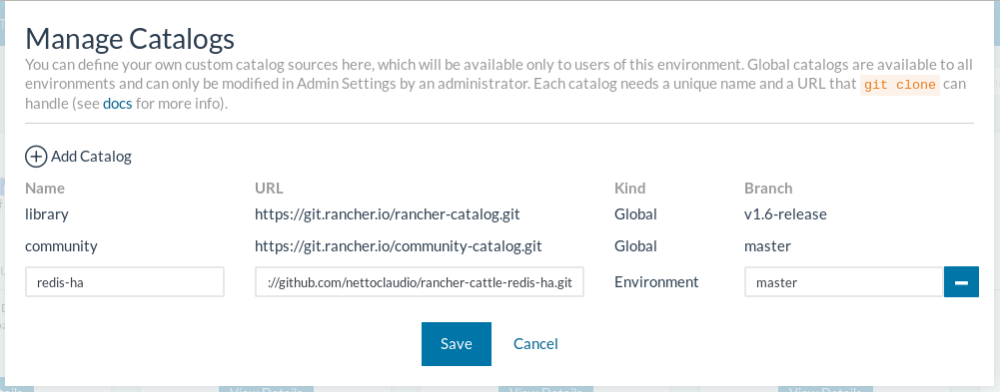
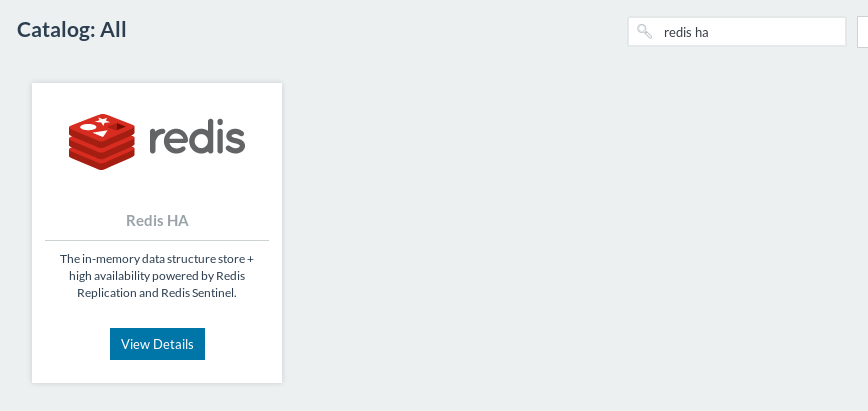
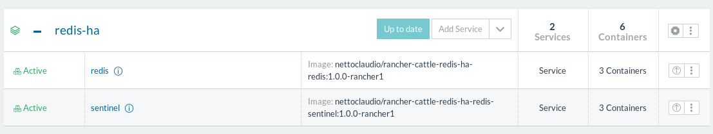

# Redis HA template for Rancher

## Requirements

1. For high-availability reasons, make sure that your [Environment](https://rancher.com/docs/rancher/latest/en/environments/#what-is-an-environment "Read about Rancher Environment") has three [Hosts](https://rancher.com/docs/rancher/latest/en/hosts/ "Read about Rancher Host") at least.

## Installation

Click on **Catalog** > **All** > **Manage** and **Add catalog**:

* Name: any (e.g., "redis-ha")
* URL: https://github.com/nettoclaudio/rancher-cattle-redis-ha.git
* Branch: master

Then click on **Save** button and wait a few minutes.

Now, back to **Catalog** page and search by "redis ha". Click on **View Details** button on Redis HA template entry.

Fill in the required fields according to the desired settings and click **Launch**.

